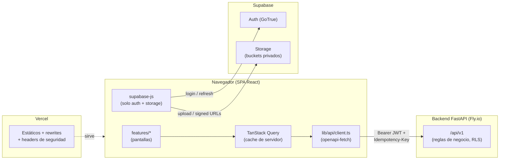

# Arquitectura del frontend

> Referencia técnica de cómo está construido el front y por qué. Para el sistema de diseño (referencia visual, tokens, componentes) ver `docs/DESIGN_SYSTEM.md`; para el contrato de la API ver `docs/API_GUIDE.md`; la guía de implementación está en `CLAUDE.md` (raíz del repo).

## 1. Qué es

SPA en **React + Vite + TypeScript estricto**, desplegada en **Vercel**, que consume la API REST del backend FastAPI (`https://compraventa-backend-dev.fly.dev/api/v1` en dev) y usa **Supabase** solo para dos cosas: **Auth** (login/refresh/invitaciones — el backend no tiene login propio) y **Storage** (subir fotos; el backend guarda solo las URLs). Toda regla de negocio vive en el backend; el front es capa de presentación + guía de usuario.

Por qué SPA y no Next.js: es un panel administrativo 100% detrás de login — no hay SEO, no hay contenido público, y el "servidor" ya existe (FastAPI). SSR agregaría una segunda capa de servidor sin beneficio. Vite + Vercel static es más simple, más barato y más rápido de iterar. (Decisión alineada con `ARCHITECTURE.md` §8 del backend: "Front: Vercel (Vite + React)".)

## 2. Panorama general



- El front **nunca le pega directo a Postgres/PostgREST** para escrituras de negocio. (La arquitectura del backend permite lecturas directas vía RLS como evolución futura; hoy TODO pasa por la API — no implementar lecturas directas sin decisión explícita.)
- `supabase-js` maneja sesión y refresh solo; el client central lee el token vigente de ahí en cada request.

## 3. Capas

```
pages (rutas)  →  components de la feature  →  hooks de api.ts (Query)  →  lib/api/client.ts  →  backend
                                    ↘  components/shared + lib (money, dates, permissions)
```

- **`lib/api/client.ts`** — `openapi-fetch` tipado con `src/types/api.ts` (generado de `/openapi.json`). Middleware único que: inyecta `Authorization` desde la sesión de Supabase; adjunta `Idempotency-Key` cuando la mutación lo declara; parsea el error uniforme `{code, message, details}` y lo convierte en `ApiError` tipado; expone helper de paginación por cursor (`fetchAllPages` / `useCursorInfiniteQuery` sobre `{items, next_cursor}`).
- **`features/<modulo>/api.ts`** — únicos archivos que llaman al client. Definen las **query keys** del módulo (`['contracts', id]`, `['contracts','list',filters]`, `['dashboard']`…) y las invalidaciones tras cada mutación. Regla: una mutación de dinero invalida su documento + listado + `['dashboard']` + `['cashbox','current']` (el dinero siempre mueve caja). **Excepción explícita:** `POST /contracts/import` (RECOMENDACIONES §1.6) usa `useMoneyMutation` solo por la `Idempotency-Key` que exige — no desembolsa nada, así que su `invalidateKeys` NO lleva `['cashbox','current']` y no debería mapear `CASH_SESSION_NOT_OPEN` (si ese código llegara ahí, es un bug del backend). `useMoneyMutation` es un mecanismo de idempotencia por acción de usuario, no un sinónimo de "mueve caja" — no asumir lo segundo por ver lo primero.
- **`features/<modulo>/pages|components`** — presentación. Sin `fetch`, sin lógica de negocio, sin formatos ad-hoc.
- **Estado:** servidor = TanStack Query (staleTime corto, `refetchOnWindowFocus` on — es una app operativa multi-usuario). UI global = Zustand mínimo (sidebar abierta, modal manager). Formularios = React Hook Form + Zod (validación de FORMA: requeridos, rangos, formato — la validación de NEGOCIO es del backend y llega como `VALIDATION_ERROR`/`BAD_REQUEST`).

## 4. Autenticación y sesión

1. Login: `supabase.auth.signInWithPassword({email, password})` → supabase-js guarda la sesión y refresca solo (`autoRefreshToken: true`). Google OAuth está decidido en CONTEXTO §2 (`signInWithOAuth({provider:'google'})`, flujo PKCE) — agregarlo cuando el proveedor esté configurado en el Supabase de dev; solo funciona para correos ya invitados (signups OFF).
2. Cada request al backend: el middleware pide `supabase.auth.getSession()` y pone `Authorization: Bearer <access_token>`.
3. Invitación (flujo de alta único — signups públicos OFF): el correo de Supabase trae un link → ruta `/auth/callback` procesa el token del link → pantalla de crear contraseña (`supabase.auth.updateUser`) → adentro. El primer request al backend activa al usuario (`invited → active`) automáticamente.
4. Claims del JWT: `company_id`, `role_id` (los inyecta el Custom Access Token Hook). El front los decodifica SOLO para routing básico (¿es super-admin? claim `app_metadata.platform_role`). No infiere permisos ni datos de empresa de los claims — para eso está `/me`.
5. **Bootstrap de sesión: `GET /api/v1/me`** inmediatamente tras login y en cada recarga, ANTES de renderizar el shell (API_GUIDE §2.6). Devuelve `user`, `company` (con `timezone` y `logo_url`), `role`, `permissions` (el set exacto que `require_permission` va a aceptar), `subscription` y `plan`. Es la fuente de: permisos de la UI (§5), zona horaria de la empresa (§7), nombre/logo en la topbar y estado de suscripción. Query key `['me']`, `staleTime` ~60s (mismo TTL del cache de permisos del backend); refetch al recuperar foco y tras mutaciones de identity (cambio de rol/permisos).
6. 401 del backend con sesión aparentemente válida: forzar `refreshSession()`; si persiste → logout con mensaje ("tu usuario o tu empresa están inactivos" — el backend responde igual en ambos casos a propósito).
7. 402 `SUBSCRIPTION_EXPIRED`: pantalla completa de bloqueo (no toast) con instrucción de contactar al administrador de la plataforma. La app no es usable con suscripción vencida. `/me.subscription.expires_at` permite además avisar antes ("tu suscripción vence en 5 días") sin esperar el bloqueo.

## 5. Permisos en la UI

RBAC dinámico por empresa (roles editables), así que los permisos NO se hardcodean por rol — se evalúan por **código de permiso** (`contracts.create`, `cashbox.open_close`…), los mismos del backend.

- La fuente es **`GET /me`** (§4.5): `permissions: string[]` es exactamente el set que `require_permission` acepta, con el mismo cache TTL 60s del backend. `lib/permissions` lo lee de la query `['me']` — `usePermission(code)` / `<Can permission="contracts.auction">` ocultan acciones; guards de ruta redirigen. (El gap que existía — no poder conocer los permisos propios sin `identity.manage_roles` — quedó resuelto con este endpoint; ver RECOMENDACIONES §1.)
- **Catálogo real observado** (17/08/2026, `permissions` del rol Admin en `/me` durante las pruebas del paso 5b — no es `GET /identity/permissions`, que sigue sin existir en el front hasta el paso 8, pero Admin trae el set más completo posible y sirvió para confirmar los códigos ya usados en el código): `audit.view`, `cashbox.expense`, `cashbox.open_close`, `cashbox.reopen`, `cashbox.view`, `catalogs.manage`, `company.configure`, `contracts.auction`, `contracts.create`, `contracts.edit`, `contracts.import`, `contracts.view`, `customers.create`, `customers.view`, `identity.manage_roles`, `identity.manage_users`, `inventory.create`, `inventory.exit`, `inventory.view`, `payments.apply_discount`, `payments.create`, `reports.view`, `sales.apply_discount`, `sales.create`, `sales.void`. Todos los códigos de contratos/pagos usados en el código hoy (`contracts.create`, `contracts.auction`, `contracts.edit`, `contracts.import`, `payments.create`) están en esta lista — confirmados, no inferidos. **Corrección real que salió de esta verificación:** `PaymentOptionsPanel` usaba `contracts.payment` (inferido, adivinado mal) — el código real es `payments.create`; se corrigió. `contracts.edit` existe y no se estaba usando — ahora gatea el botón "Editar" del detalle de contrato (antes quedaba visible sin gate, igual que `customers`/`catalogs` en el paso 4, que siguen así — fuera de alcance de este paso). `contracts.view`/`customers.view` existen pero ninguna ruta los usa todavía (las listas de contratos/clientes no tienen guard de ruta) — quedan para cuando se revise permission-gating de rutas de forma sistemática, no específico de este paso.
- Un `PERMISSION_DENIED` inesperado (el rol cambió por debajo, cache de 60s) → invalidar `['me']` además del toast: la UI se corrige sola en el siguiente render.
- La UI oculta; **el backend es la única autoridad**. Nunca asumir que ocultar un botón protege nada.

## 6. Manejo de errores (por `code`, nunca por `message`)

`lib/api/errors.ts` centraliza el mapa código→comportamiento. Toda mutación pasa por él salvo override local explícito.

| `code` | Comportamiento en el front |
|---|---|
| `UNAUTHORIZED` (401) | Refresh de sesión → si falla, logout con aviso. |
| `PERMISSION_DENIED` (403) | Toast "No tienes permiso para esta acción" + invalidar `['me']` (los permisos cambiaron por debajo — la UI se corrige sola). |
| `SUBSCRIPTION_EXPIRED` (402) | Pantalla de bloqueo total. |
| `NOT_FOUND` (404) | Página/estado "no encontrado" (puede ser de otra empresa — no se distingue, no intentarlo). |
| `VALIDATION_ERROR` (422) | Volcar `details.errors` campo a campo en el form (RHF `setError`). |
| `CASH_SESSION_NOT_OPEN` (409) | **Modal central "Abrir caja"** con CTA directo a abrir sesión (si tiene `cashbox.open_close`) o aviso de pedirle al responsable. Nunca un toast seco. |
| `CASH_SESSION_ALREADY_OPEN` / `ALREADY_CLOSED_TODAY` (409) | Modal explicativo del ciclo diario único; refrescar `['cashbox','current']`. |
| `PAYMENT_PARTIAL_INTEREST_REJECTED` (422) | No debería ocurrir si la UI usa `payment-options`; si ocurre, modal explicando "solo meses completos" y recargar opciones. |
| `CONTRACT_CLOSED` / `CONTRACT_NOT_READY_FOR_AUCTION` (400/409) | Modal explicativo + refetch del contrato (estado cambió por debajo). |
| `LAST_ADMIN_SAFEGUARD` (409) | Modal explicativo — mostrar, NO reintentar. |
| `IDEMPOTENCY_KEY_REQUIRED` (400) | Bug del front — reportar a Sentry, mensaje genérico. |
| `CONFLICT` (409) | Mensaje contextual de la feature (doc duplicado, letra de código repetida…). |
| `BAD_REQUEST` (400) | Mostrar `message` del backend en el contexto del form/acción. |
| `CONTRACT_LEGACY_CODE_EXISTS` (409) | Import de contratos (RECOMENDACIONES §1.6): "Este contrato ya fue migrado" — link al contrato existente si se puede resolver por búsqueda de `legacy_code`. |
| `IMPORT_CAPITAL_EXCEEDS_PRINCIPAL` (422) | Import de contratos: `capital_balance` ≤ 0 o > `principal` — validar en vivo mientras se escribe, no esperar el submit. |
| `IMPORT_DATES_MISALIGNED` (422) | Import de contratos: `interest_paid_until` no cae en un múltiplo entero de meses desde `start_date` — evitarlo con un selector "N meses desde el inicio" en vez de dos date pickers libres. |
| red / 5xx | Toast con retry; las mutaciones de dinero reintentan con la MISMA `Idempotency-Key`. |

## 7. Dinero, fechas y paginación (los tres transversales)

- **Dinero (`lib/money.ts`):** la API usa strings decimales (`"1000000.00"`). `formatCOP(value)` → `Intl.NumberFormat('es-CO', {style:'currency', currency:'COP', maximumFractionDigits: 0|2})` → `$ 2.664.500` (puntos de miles SIEMPRE, requisito explícito). `<MoneyInput>` enmascara con puntos mientras se escribe y emite el string decimal normalizado para la API. Aritmética de dinero en el front: prohibida salvo sumas de presentación (total del carrito de venta) hechas sobre enteros de centavos, nunca floats; los montos con reglas (intereses, saldos, expected_cash) SIEMPRE vienen del backend.
- **Fechas (`lib/dates.ts`):** `date-fns` + `@date-fns/tz`. La zona activa viene de **`/me.company.timezone`** (el mismo valor con el que el backend calcula "hoy" — sincronía perfecta por construcción), con `'America/Bogota'` como fallback hasta que `/me` cargue. `todayBogota()` para toda lógica de "hoy" (¿la sesión de caja es de hoy?, defaults de filtros de fecha); `formatDate`/`formatDateTime` (`dd/MM/yyyy`, `dd/MM/yyyy h:mm a`) para todo timestamptz de la API. Fechas-sin-hora (vencimientos, `session_date`) se muestran tal cual, sin pasarlas por `Date` (evita el corrimiento de un día por UTC). Espejo exacto de la regla §10 del backend.
- **Paginación:** todas las listas usan `{items, next_cursor}` → `useCursorInfiniteQuery` + `<DataTable>` con "cargar más" / scroll infinito. No hay paginación por número de página en la API: no inventarla.

## 8. Seguridad

- **Claves:** solo `VITE_SUPABASE_ANON_KEY` (publishable) vive en el front — es pública por diseño; RLS + permisos del backend son la protección real. La `service_role` **jamás** aparece en este repo (grep en CI).
- **Tokens:** los gestiona supabase-js (localStorage + auto-refresh). Mitigación del riesgo XSS (el que importa en una SPA): CSP estricta, cero `dangerouslySetInnerHTML`, dependencias auditadas (`npm audit` + Dependabot), React escapa por defecto.
- **Headers en `vercel.json`:** `Content-Security-Policy` (default-src 'self'; connect-src self + API + Supabase; img-src self + Storage + data:; frame-ancestors 'none'), `X-Content-Type-Options: nosniff`, `Referrer-Policy: strict-origin-when-cross-origin`, `Permissions-Policy` mínima. HSTS lo pone Vercel.
- **Habeas Data (Ley 1581):** fotos de cédulas, prendas y contratos firmados → buckets **privados** por empresa en Storage, paths con `company_id`, acceso por **URLs firmadas de vida corta** pedidas al momento de mostrar; nunca URLs públicas ni copias en cache del front. `PhotoUploader` comprime client-side antes de subir (ahorra datos y evita subir EXIF con GPS: se limpia al comprimir).
- **Sesión operativa:** logout por inactividad a las **6 horas** (decidido con el cliente el 15/08/2026; constante central `INACTIVITY_LOGOUT_MS` en `lib/auth/` por si se ajusta). Al hacer logout, `queryClient.clear()` (no dejar datos de la empresa en memoria de otra sesión).
- **CORS:** ya resuelto en el backend (`app/common/cors.py`, backend ARCHITECTURE §8): en `dev` acepta `localhost:5173`/`localhost:3000` y cualquier preview `https://*.vercel.app` sin configurar nada; en prod SOLO los orígenes exactos del secret `CORS_ALLOW_ORIGINS`. Pendiente operativo al lanzar prod: registrar el dominio definitivo de Vercel en ese secret — sin eso, prod rechaza toda request de browser.

## 9. Rutas y layouts

- `/auth/*` — AuthLayout (login, recuperar, callback de invitación). Sin sidebar.
- `/*` — AppShell (sidebar + topbar + `CashSessionBanner` + `<Outlet>`), protegido por sesión + suscripción. Rutas por módulo: `/` (dashboard), `/contratos`, `/contratos/:id`, `/clientes`, `/inventario`, `/ventas`, `/caja`, `/catalogos`, `/usuarios`, `/roles`, `/auditoria`, `/reportes`, `/configuracion`. URLs en español (las ve el usuario).
- `/platform/*` — PlatformLayout (solo `super_admin`): empresas, planes. Visualmente diferenciado (banda superior distinta) para que un super-admin nunca confunda contexto.
- Lazy loading por feature (`React.lazy` por ruta) — el bundle inicial solo carga shell + dashboard.

## 10. Testing

- **Unidad (Vitest):** `money.ts` (formateo/parseo con puntos de miles, redondeos de presentación), `dates.ts` (con el instante exacto del bug de las 7pm–medianoche como caso fijo, igual que el backend), mapeo de errores, armado del árbol de categorías.
- **Componentes (Testing Library + MSW):** los flujos que mueven dinero — abono desde payment-options, cierre de caja con descuadre (exige justificación), venta POS, y el modal de `CASH_SESSION_NOT_OPEN`. MSW sirve además para desarrollar sin backend.
- **E2E (Playwright, smoke):** login → abrir caja → crear contrato → abono → cierre, contra el backend dev. Corre manual/nightly, no en cada PR.
- **CI (GitHub Actions):** lint + `tsc` + Vitest en cada PR; job que regenera tipos contra el `openapi.json` exportado del backend y falla si hay drift (detecta breaking changes de API antes del deploy).

## 11. Entornos y despliegue

- **Vercel:** proyecto conectado al repo. `main` → producción (apuntará al backend prod cuando exista); `dev` → preview fija con `VITE_API_URL` del backend dev. Mismo esquema de ramas que el backend: nada llega a `main` sin pasar por `dev`.
- SPA fallback: rewrite de todas las rutas a `/index.html` en `vercel.json` (excepto assets).
- Variables por entorno en el dashboard de Vercel (`VITE_API_URL`, `VITE_SUPABASE_URL`, `VITE_SUPABASE_ANON_KEY`) — el bundle las incrusta en build: cambiar de backend = redeploy, no editar archivos.
- Backend prod pendiente (proyecto Supabase propio, ver backend §8) — el front nace apuntando a dev y el switch es solo de variables.
